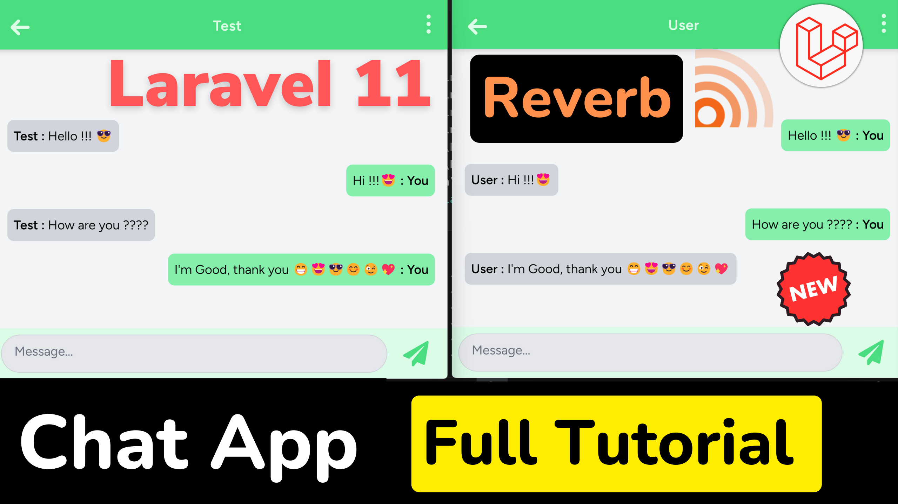

<p align="center">
    <a href="https://laravel.com" target="_blank">
        
    </a>
</p>

<p align="center">
    <a href="https://github.com/laravel/framework/actions"></a>
    <a href="https://packagist.org/packages/laravel/framework"></a>
    <a href="https://packagist.org/packages/laravel/framework"></a>
    <a href="https://packagist.org/packages/laravel/framework"></a>
</p>

## Laravel Chat Application

Welcome to the Laravel Chat Application! This application allows you to create real-time chat conversations between users using the Laravel framework. It includes features such as user authentication, chat rooms, and real-time messaging.



## Features

- **Real-time messaging:** Chat messages are sent and received instantly using WebSocket technology.
- **User authentication:** Register, login, and logout functionality for users.
- **Chat rooms:** Users can create or join chat rooms to communicate with other users.
- **User profiles:** View and edit user profile information.
- **Secure communication:** Messages are transmitted securely over the network.

## Installation and Setup

Follow the instructions below to install and run the project on your local machine:

### Step 1: Clone the Repository

Clone the repository from GitHub:

```bash
git clone https://github.com/AjayYadavAi/laravel-reverb-chat-app.git
```

### Step 2: Navigate to the Project Directory

Change to the project directory:

```bash
cd laravel-chat-app
```

### Step 3: Install Dependencies

Install the required PHP and JavaScript dependencies:

```bash
composer install
npm install
```

### Step 4: Create an Environment File

Copy the `.env.example` file to a new file named `.env`:

```bash
cp .env.example .env
```

Configure the `.env` file with your database and other settings.

### Step 5: Generate an Application Key

Generate a new application key:

```bash
php artisan key:generate
```

### Step 6: Run Migrations and Seed the Database

Run the migrations to set up the database schema:

```bash
php artisan migrate
```

Seed the database with default data (if available):

```bash
php artisan db:seed
```

### Step 7: Start the WebSocket Server

To enable real-time messaging, you need to start the Reverb server:

```bash
php artisan reverb:start
```

### Step 8: Start the Application

Start the Laravel application:

```bash
php artisan serve
```

The application will run on `http://127.0.0.1:8000`.


## License

This project is licensed under the [MIT License](https://opensource.org/licenses/MIT).

## Contributing

Contributions are welcome! Please fork this repository and submit pull requests for any improvements or bug fixes.
